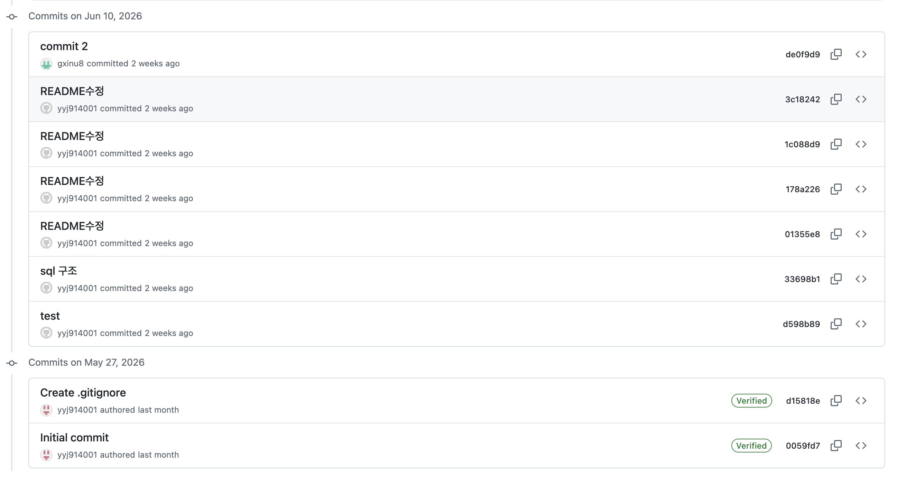
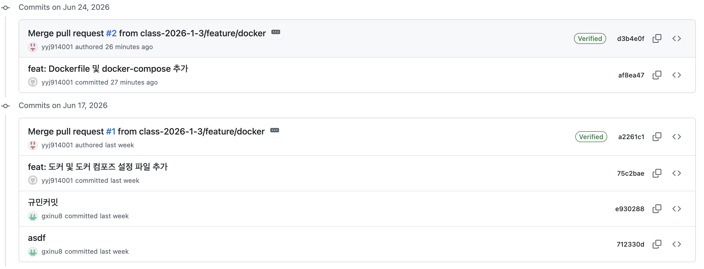

# team-3-12--project

## 뭐 먹지 고민될 때는 < 오늘 뭐 먹지? >  
  - 팀원소개 : 1303 김규민, 1312 양유진 

  - 프로젝트 소개 : "오늘 뭐 먹지?"는 사용자가 음식 메뉴를 쉽고 빠르게 결정할 수 있도록 도와주는 메뉴 추천 서비스입니다.
    
    사용자의 선호도와 음식 종류를 기반으로 다양한 메뉴를 추천하며, 음식점 정보와 위치, 랜덤 추천 기능, 룰렛 기능 등을
    함께 제공하여 보다 효율적인 식사 선택이 가능하도록 설계하였습니다. 
  
  - 주제 선정 이유  
    친구와 만나 밥먹기 전 메뉴 선정에 있어 고민만 한참하니까 효율적인 메뉴 선정을 위해 이 주제를 선정하게되었습니다.  

  - 프로젝트 구조 설명  
TEAM.PROJECT
└── team-3-12--project
    ├── sql
    │   ├── Dockerfile
    │   └── mysql
    ├── web_front
    │   ├── css
    │   ├── html
    │   ├── js
    │   └── Dockerfile
    ├── .gitignore
    ├── docker-compose.yml
    ├── image-1.png
    ├── image.png
    └── README.md

  - 주요 기능 목록
    1) 메뉴 추천 기능
    사용자가 메뉴를 정하지 못할 때 랜덤으로 메뉴를 추천

    2) 룰렛 기능
    메뉴 선택에 재미 요소를 추가하기 위해 룰렛 기능 제공

    3) 지도 맛집 추천 기능
    추천된 메뉴를 기반으로 주변 음식점 정보 제공
    카카오맵 지도 API를 활용하여 음식점 위치 확인 가능  

    4) 맛집 랭킹 기능
    음식점 평점을 기준으로 순위 제공
    사용자들이 인기 있는 음식점을 쉽게 확인 가능

    5) 사용자 관리 기능
    로그인 기능 제공
    사용자 정보 저장 및 관리

    6) 한줄평 작성 기능
    사용자가 음식점에 대한 간단한 후기 작성 가능
    다른 사용자들의 평가 확인 가능

    7) 메뉴 검색 기능
    먹고 싶은 음식을 검색하여 관련 음식점 조회 가능 

  - db구축  
    {foods}  
    user table(id, passward, name, address)  
    store table(name, id, address, score(평점), comment(한줄평))  
    menu table(menu_id, kor, japan, chin, des(디저트))    

  - 기여 방법
    
    
  
  - 기대 효과

    메뉴 선택 시간 단축   
    다양한 음식 정보 제공   
    음식점 평점 및 후기 확인 가능 
    사용자의 편의성 향상  
    친구들과의 의사결정 과정 간소화

  - 어려웠던 점 및 해결 방법

    GitHub 협업 과정

    프로젝트를 진행하면서 가장 어려웠던 점은 GitHub 사용법을 잘 알지 못했다는 점입니다. 특히 브랜치(Branch)의 개념을 이해하지 못해 코드를 관리하거나   팀원과 협업하는 과정에서 어려움을 겪었습니다. 처음에는 브랜치를 왜 나누어 사용하는지, 어떻게 병합(Merge)하는지 이해하기 어려웠습니다. GitHub 사용법을 찾아보고 직접 실습해 보며 브랜치 생성, 커밋, 병합 과정을 익힐 수 있었습니다. 
    앞으로는 Git과 GitHub 관련 강의와 자료를 통해 협업 도구 사용 능력을 더욱 향상시키고, 다양한 프로젝트를 경험하며 익숙해질 계획입니다.

  